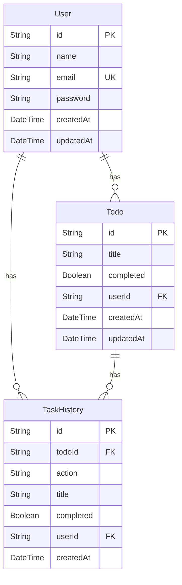
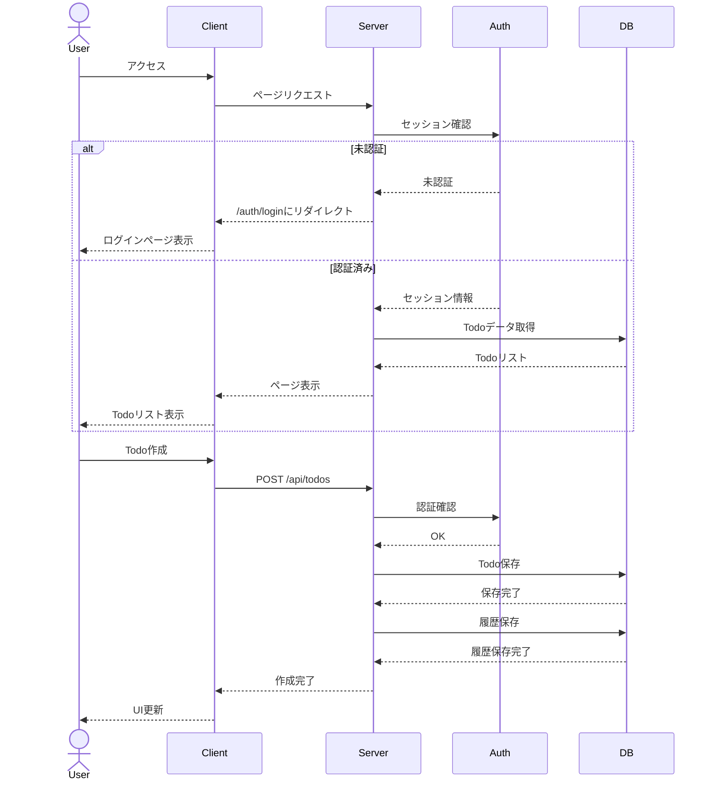

# Todo App

Next.js 13とPrismaを使用したモダンなTodoアプリケーション。

## 機能

- ユーザー認証（NextAuth.js）
  - GitHub認証
  - Google認証
  - メール/パスワード認証
- Todoの作成、読み取り、更新、削除（CRUD）
- Todoのフィルタリング（全て、アクティブ、完了済み）
- レスポンシブデザイン

## ER図



## シーケンス図



## 技術スタック

- フロントエンド
  - Next.js 13 (App Router)
  - TypeScript
  - Tailwind CSS
  - shadcn/ui

- バックエンド
  - Next.js API Routes
  - Prisma
  - PostgreSQL
  - NextAuth.js

## セットアップ

1. リポジトリのクローン

```bash
git clone <repository-url>
cd todo-app
```

2. 依存関係のインストール

```bash
npm install
```

3. 環境変数の設定

```bash
cp .env.example .env
# .envファイルを編集して必要な環境変数を設定
```

4. データベースのセットアップ

```bash
npx prisma migrate dev
```

5. 開発サーバーの起動

```bash
npm run dev
```

## 環境変数

```env
DATABASE_URL="postgresql://..."
NEXTAUTH_SECRET="your-secret-key"
NEXTAUTH_URL="http://localhost:3000"

# OAuth providers
GITHUB_ID="your-github-id"
GITHUB_SECRET="your-github-secret"
GOOGLE_CLIENT_ID="your-google-client-id"
GOOGLE_CLIENT_SECRET="your-google-client-secret"
```

## ライセンス

MIT
